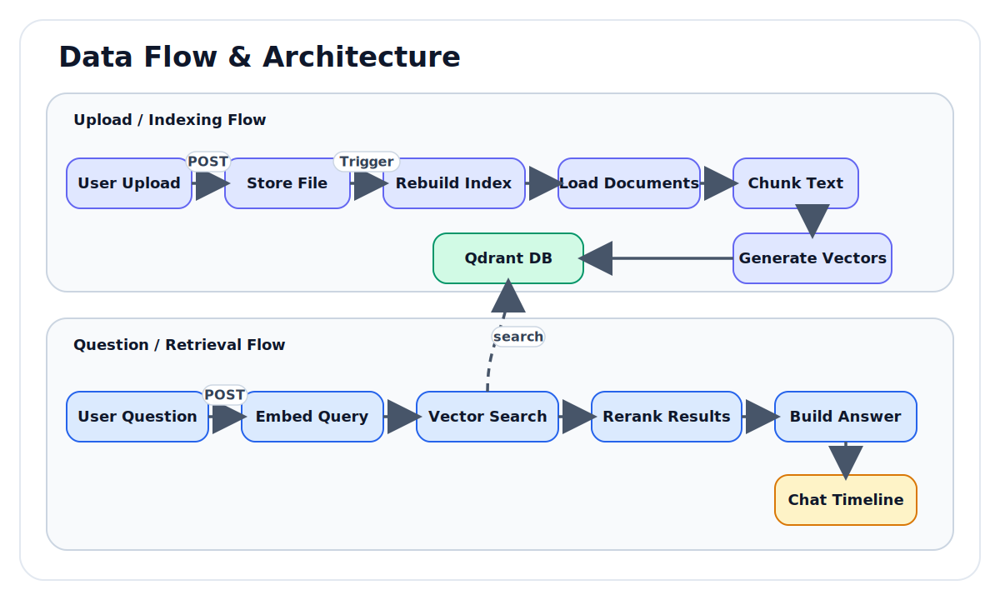
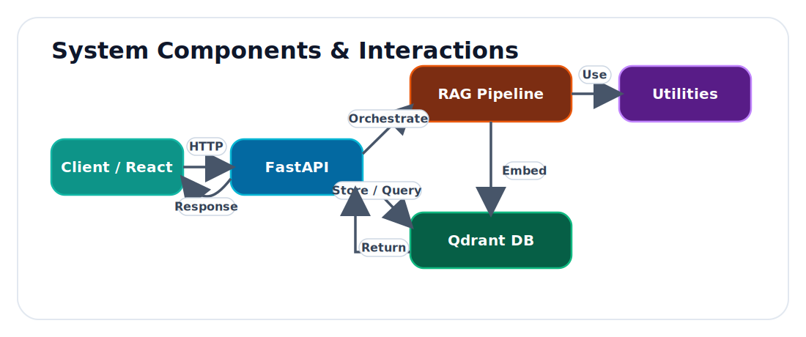

# DocuMind

DocuMind is a full-stack Retrieval-Augmented Generation (RAG) workspace for document Q and A.
It combines a FastAPI backend, a React + TypeScript frontend, and Qdrant for vector search.

The project is built for practical learning and real usage: upload files, index incrementally, query with citations, inspect evidence, and evaluate retrieval behavior.

## Why DocuMind

- Hybrid, modular RAG architecture (ingestion, chunking, embeddings, retrieval, generation).
- Incremental indexing flow designed for upload-driven updates.
- Frontend chat workspace with thread history and evidence display.
- Optional evaluation mode for metric-based retrieval experiments.
- OCR support for image-based documents.

## Data Flow & Architecture



## System Components & Interactions



## Tech Stack

- Backend: FastAPI, Pydantic, Uvicorn
- RAG Services: custom pipeline modules under backend/app/src
- Vector Store: Qdrant
- Embeddings: OpenAI or SentenceTransformers with safe fallback
- Frontend: React 19, TypeScript, Vite
- OCR: PaddleOCR + Pillow

## Project Structure

```text
DocuMind/
	backend/
		app/
			main.py
			src/
				chunking/
				embeddings/
				evaluation/
				generation/
				ingestion/
				ocr/
				rag/
				retrieval/
				vector_store/
		data/
		scripts/
	frontend/
		src/
```

## Prerequisites

- Python 3.10+ (3.11 recommended)
- Node.js 20+ and npm
- Docker Desktop (for Qdrant)
- Windows PowerShell or any shell equivalent

## Quick Start

### 1. Start Qdrant

Run Qdrant in Docker:

```powershell
docker run -p 6333:6333 qdrant/qdrant:latest
```

Sanity checks:

- API root: http://localhost:6333/
- Dashboard UI: http://localhost:6333/dashboard/

### 2. Configure and run backend

From the repository root:

```powershell
cd backend
python -m venv ..\venv
..\venv\Scripts\Activate.ps1
python -m pip install --upgrade pip
python -m pip install -r requirements.txt
uvicorn app.main:app --reload --host 0.0.0.0 --port 8000
```

Backend health checks:

- http://localhost:8000/health
- http://localhost:8000/index/stats
- http://localhost:8000/ingestion/preview

### 3. Configure and run frontend

Open a new terminal from repository root:

```powershell
cd frontend
npm install
npm run dev
```

Frontend URL:

- http://localhost:5173

## Environment Variables

Backend environment file is loaded from .env at repository root.

Common variables:

- OPENAI_API_KEY: required for OpenAI embeddings.
- DOCUMIND_EMBED_PROVIDER: auto, openai, or local.
- DOCUMIND_OPENAI_EMBED_MODEL: defaults to text-embedding-3-small.
- DOCUMIND_SBERT_MODEL: defaults to all-MiniLM-L6-v2.
- DOCUMIND_EMBED_CACHE_SIZE: embedding cache size.
- DOCUMIND_ENABLE_EVALUATION: set to 1 to enable evaluation endpoint.
- DOCUMIND_CORS_ORIGINS: comma-separated explicit origins.
- DOCUMIND_CORS_ORIGIN_REGEX: regex-based CORS allow list.

Frontend optional variable:

- VITE_API_BASE_URL: override backend API base URL.

## Typical User Workflow

1. Start Qdrant, backend, and frontend.
2. Upload documents from the sidebar.
3. Trigger indexing after upload.
4. Ask questions in chat.
5. Inspect citations and evidence chunks.
6. Iterate chunking strategy and chunk size if quality needs improvement.

## Core API Endpoints

- GET /health
- GET /ingestion/preview
- POST /ingestion/upload
- DELETE /ingestion/files/{file_name}
- POST /index/rebuild
- GET /index/stats
- POST /rag/query
- GET /evaluation/status
- POST /evaluation/run
- POST /ocr/extract

## Evaluation Mode

Enable advanced evaluation:

```powershell
$env:DOCUMIND_ENABLE_EVALUATION="1"
```

Then run either:

- API endpoint POST /evaluation/run
- Script backend/scripts/run_experiment.py

Note: meaningful metrics require labeled queries with relevant_ids.

## Troubleshooting

### Frontend dev server fails

- Ensure dependencies are installed with npm install.
- Confirm port 5173 is free, because the project uses strictPort.

### Qdrant connection issues

- Verify Docker container is running.
- Confirm http://localhost:6333/ is reachable.
- Ensure no firewall or port conflict on 6333.

### Backend starts but queries fail

- Confirm Qdrant is up before sending /rag/query.
- Upload at least one supported document and rebuild index.
- Check backend logs for model loading or OCR-related errors.